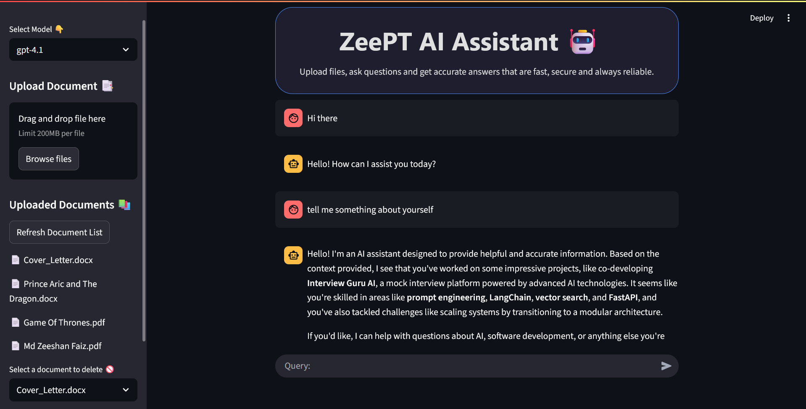

# 🤖 ZeePT RAG Chatbot

A fully functional **Retrieval-Augmented Generation (RAG)** chatbot powered by **LangChain**, **FastAPI**, and **Streamlit**, all running on **free OpenAI-compatible models** via **GitHub Inference** with no credits required!



---

## 💡 What Can This App Do?

- 📄 Upload documents (`.pdf`, `.docx`, `.html`) and ask questions based on their content.
- 🧠 Chat with context-aware answers via Retrieval-Augmented Generation (RAG).
- 🌍 Answer general knowledge queries using models like `gpt-4o`, `gpt-4o-mini`, and `gpt-4.1`.
- 💬 View conversation history with session-based tracking.
- 🧼 Delete or manage uploaded documents dynamically.
- 🖥️ Run it locally or try it instantly on HuggingFace Spaces.

---

## ⚙️ How It's Made

This project brings together the power of modern LLM infrastructure:

### 🔨 Technologies & Libraries Used

| Tool            | Purpose                                        |
|-----------------|------------------------------------------------|
| `LangChain`     | Building the RAG pipeline (retriever, chains) |
| `FastAPI`       | Backend API server for document and chat flow |
| `Streamlit`     | Lightweight frontend for chat UI              |
| `ChromaDB`      | Vector store for document chunk storage       |
| `GitHub Inference API` | Free access to OpenAI-compatible models  |
| `HuggingFace Spaces` | Cloud hosting and deployment             |

---

## 🧪 Run It Locally

Follow these steps to get it running on your local machine:

### 1️⃣ Clone the Repository

```bash
git clone https://github.com/Zeeshan-Faiz/ZeePT-Chatbot.git
cd ZeePT-chatbot
```

### 2️⃣ Install Requirements
Make sure you have Python 3.10+ and run:

```bash
pip install -r requirements.txt
```

### 3️⃣ Create .env File
Create a .env file in the root directory:

```bash
GITHUB_TOKEN=ghp_your_actual_token_here
```
Replace with your [GitHub Personal Access Token](https://github.com/settings/tokens) with access to GitHub-hosted inference models.

### 4️⃣ Run the Backend (FastAPI)

```bash
uvicorn main:app --reload
```
It’ll start running at: http://localhost:8000/docs

### 5️⃣ Run the Frontend (Streamlit)
In a new terminal:

```bash
streamlit run streamlit_app.py
```
Open the link shown (usually http://localhost:8501) in your browser.

---

## 🚀 Try It Online (No Setup Needed)

👉 Try on Hugging Face Spaces
[ZeePT RAG Chatbot](https://huggingface.co/spaces/MrFaiz07/ZeePT_RAG_Chatbot)

Hosted version with no installation or config needed. Just open and start chatting!
